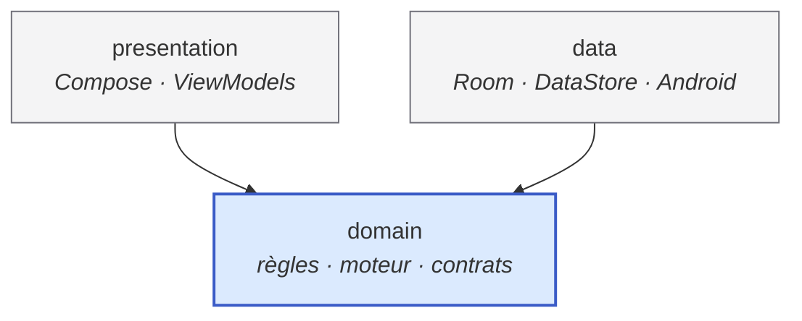
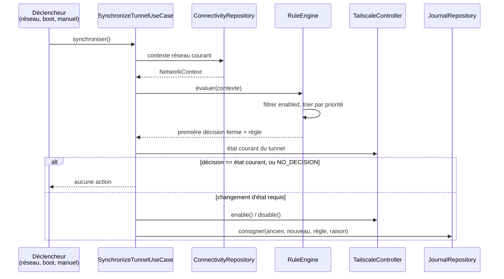
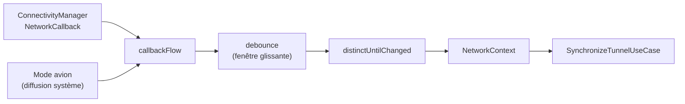
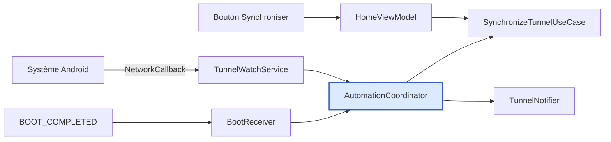

# Architecture — Tailscale Auto Rules

Ce document décrit **comment** le projet est construit. Le **quoi** est décrit
dans [SPECS.md](./SPECS.md).

> **État d'avancement.** Les sections marquées *(cible)* décrivent la structure
> visée ; elles se matérialisent au fil de [TASKS.md](./TASKS.md). Ce qui existe
> aujourd'hui est indiqué en §9. Ce document est mis à jour **à chaque étape**,
> jamais en avance.

---

## 1. Vue d'ensemble

Trois couches, une seule direction de dépendance.



**La règle de dépendance, unique et non négociable : tout pointe vers
`domain`, `domain` ne pointe vers rien.**

En particulier :

- `domain` ne contient **aucun** import `android.*`, `androidx.*`, Room,
  DataStore, Hilt ou Compose.
- `data` implémente les interfaces déclarées par `domain`.
- `presentation` consomme `domain` et ignore l'existence de `data`.

### 1.1 Pourquoi deux modules Gradle *(cible)*

La séparation en paquets repose sur la discipline ; la séparation en **modules
Gradle** la rend mécanique :

| Module | Type | Contenu |
|---|---|---|
| `:domain` | bibliothèque Kotlin/JVM pure | Modèle, règles, moteur, interfaces de contrat |
| `:app` | application Android | `presentation` + `data` + injection |

`:domain` n'a pas le SDK Android sur son classpath : une dépendance Android y
devient une **erreur de compilation**, et non une remarque de revue. Ses tests
sont de simples tests JUnit JVM, sans Robolectric ni émulateur.

`:app` regroupe `presentation` et `data`. Les séparer davantage n'apporterait
rien à ce stade : ils partagent le cycle de vie Android et ne sont pas
réutilisables indépendamment.

---

## 2. Structure des paquets *(cible)*

```
:domain  fr.vbrosseau.tailscaleautorules.domain
├── model/          TunnelState, NetworkContext, NetworkTransport, RuleDecision,
│                    NetworkException + sa clé canonique…
├── rule/           Rule, RuleId, RuleEvaluation + une classe par règle
├── engine/         RuleEngine — tri, évaluation, sélection
├── repository/     Interfaces : BlacklistRepository, JournalRepository,
│                    NetworkExceptionRepository, SettingsRepository
├── tailscale/      Interface TailscaleController
└── usecase/        SynchronizeTunnelUseCase — orchestration d'un cycle complet
                    DetectManualOverrideUseCase — reconnaît un geste manuel sur le tunnel
                    RecordManualOverrideUseCase — le mémorise en exception dynamique
                    CaptureManualOverrideUseCase — détection + mémorisation sur l'état courant

:app     fr.vbrosseau.tailscaleautorules
├── presentation/
│   ├── theme/      AppTheme, palette, échelle d'espacement
│   ├── home/       HomeScreen, HomeViewModel, HomeUiState
│   ├── blacklist/  BlacklistScreen, BlacklistViewModel, BlacklistUiState
│   ├── settings/   SettingsScreen, SettingsViewModel, SettingsUiState
│   ├── journal/    JournalScreen, JournalViewModel, JournalUiState
│   └── navigation/ AppNavHost, destinations
├── data/
│   ├── local/      Base Room, DAO, entités, DataStore
│   ├── network/    Observation de la connectivité, lecture du SSID
│   ├── tailscale/  Implémentations de TailscaleController
│   └── repository/ Implémentations des interfaces de domain
├── automation/     Service de premier plan, receveur de boot, coordination
└── di/             Modules Hilt
```

---

## 3. Le moteur de règles

C'est le cœur du projet et le seul composant dont la couverture de tests visée
est de ~100 %.

### 3.1 Pattern retenu — Strategy

Chaque règle est une **stratégie** indépendante implémentant un contrat commun.
Le moteur n'en connaît que le contrat. Conséquence directe : **ajouter une règle
consiste à ajouter une classe et à l'enregistrer dans l'injection — le moteur
n'est jamais modifié.**

### 3.2 Contrat

```kotlin
interface Rule {
    val id: RuleId
    val defaultSettings: RuleSettings      // isEnabled + priority
    fun evaluate(context: RuleContext): RuleDecision
}

data class RuleContext(
    val network: NetworkContext,
    val blacklistedSsids: Set<String> = emptySet(),
    val settings: Map<RuleId, RuleSettings> = emptyMap(),
)
```

`evaluate` est **pure** : pas d'I/O, pas d'horloge, pas de journalisation, pas
d'accès à l'état du tunnel. Tout ce dont une règle a besoin est dans
`RuleContext` — état réseau **et** configuration de l'utilisateur.

Regrouper les deux dans un même contexte, plutôt qu'injecter des dépendances
dans chaque règle, a trois conséquences :

- une règle est un objet **sans état**, donc un singleton sans risque ;
- les réglages restent modifiables à l'exécution sans que les règles changent ;
- la couverture exhaustive devient atteignable : une règle se teste en
  construisant un contexte et en comparant la décision attendue.

`RuleEvaluation` porte la décision **et** l'identifiant de la règle qui l'a
rendue, avec l'invariant qu'une décision ferme désigne toujours sa règle. Le
domaine ne porte aucun libellé : traduire un `RuleId` en texte lisible
appartient à la présentation, seule à connaître la langue de l'utilisateur.

### 3.3 Cycle de synchronisation



### 3.4 Ajouter une règle

1. Créer la classe dans `:domain/rule/`, implémentant `Rule`.
2. Choisir une `priority` qui ne crée pas d'ambiguïté avec les règles
   existantes (voir le tableau de [SPECS.md](./SPECS.md) §4).
3. Écrire ses tests unitaires : **chaque** branche de `evaluate`, y compris les
   cas retournant `NO_DECISION`.
4. Enrichir `NetworkContext` **uniquement** si la donnée nécessaire n'y est pas
   déjà — et alors mettre à jour les fabriques de test.
5. L'enregistrer dans `RuleModule` — **le seul fichier de l'application à
   modifier**. Les règles y sont construites via `@Provides @IntoSet` plutôt
   qu'annotées `@Inject`, ce qui garde `:domain` exempt de toute annotation
   d'injection, `javax.inject` comprise.

Aucune modification du moteur, ni des règles existantes, n'est requise. Si une
étape vous impose d'en modifier une, c'est le signe que l'abstraction est à
revoir : signalez-le plutôt que de contourner.

---

## 4. Abstraction de Tailscale

```kotlin
interface TailscaleController {
    suspend fun isAvailable(): Boolean
    suspend fun enable(): Result<Unit>
    suspend fun disable(): Result<Unit>
    suspend fun isRunning(): Boolean
}
```

| Implémentation | Module | Usage |
|---|---|---|
| `AndroidTailscaleController` | `:app` / `data/tailscale` | Production — diffusion explicite vers `IPNReceiver` |
| `FakeTailscaleController` | `:domain` / `testFixtures` | Tests — état en mémoire, inspectable, injection d'échec |

Les Fakes vivent dans le source set `testFixtures` de `:domain` : ils sont
ainsi partagés par les tests des deux modules sans être embarqués dans l'APK.

Le retour `Result` est délibéré : piloter une application tierce **échoue
normalement** — client absent, diffusion refusée, canal modifié. L'échec est
une valeur de retour attendue, pas une exception à rattraper au petit bonheur.
`TailscaleUnavailableException` distingue le cas « aucun client installé », qui
est une issue nominale.

Il n'existe pas d'implémentation `NoOp` : l'absence de client est déjà un
échec explicite d'`AndroidTailscaleController`. Une classe supplémentaire
n'ajouterait qu'un chemin de code à maintenir.

Le canal de commande retenu et ses trois contraintes sont établis et justifiés
dans [SPECS.md](./SPECS.md) §10.1.

---

## 5. Observation du réseau

`ConnectivityManager.NetworkCallback` est enveloppé dans un `Flow` par la couche
`data`, puis exposé au domaine sous forme de `NetworkContext`.



- **`debounce`** absorbe les rafales d'événements d'une même transition réseau.
- **`distinctUntilChanged`** garantit qu'un contexte identique ne provoque pas
  de nouvelle évaluation ; il repose sur l'égalité structurelle de
  `NetworkContext`.
- La fenêtre de debounce est **injectée**, jamais codée en dur : les tests la
  pilotent via l'ordonnanceur virtuel de `kotlinx-coroutines-test`.
- La synchronisation manuelle passe par `NetworkObserver.current()` et
  contourne donc le debounce.

Point de conception : la stabilisation est un **opérateur du domaine**
(`Flow<NetworkContext>.stabilized(window)`), pas un détail de la couche `data`.
La couche Android se contente de produire des contextes bruts et d'appliquer
l'opérateur. Le comportement le plus délicat du projet après le moteur se teste
ainsi en JVM pur, en temps virtuel, sans Robolectric.

La lecture du SSID emprunte deux chemins selon la plateforme :
`NetworkCapabilities.getTransportInfo()` à partir d'Android 12, `WifiManager`
avant. Sans permission de localisation, le système renvoie une valeur de repli,
traitée comme une indisponibilité — jamais comme un SSID valide.

Le temps est abstrait derrière une interface `Clock` du domaine. Aucun appel à
`System.currentTimeMillis()` en dehors de son implémentation.

---

## 6. Présentation

MVVM strict :

- Le ViewModel expose **un** `StateFlow<XxxUiState>` et rien d'autre.
- Cet état est publié via `stateIn(viewModelScope, WhileSubscribed(5 s), …)`
  (`UiStateSharing`) : les observations — rappels réseau, lecture continue de
  Room — ne vivent que lorsqu'un écran collecte, et le délai de grâce couvre
  une rotation sans tout réenregistrer.
- `UiState` est immuable et **complètement** descriptif de l'écran : un
  Composable ne calcule jamais.
- Le ViewModel **traduit** ; il ne décide pas. Toute logique métier vit dans un
  cas d'usage du domaine.
- Les Composables sont sans état, reçoivent l'état et des lambdas, et sont
  prévisualisables sans injection.

Une @Preview qui ne compile pas sans Hilt signale une fuite de responsabilité.

`AppNavHost` est le **seul** endroit où un ViewModel rejoint un écran. Les
écrans eux-mêmes ne reçoivent qu'un `UiState` et des lambdas, ce qui les rend
prévisualisables et testables sans injection.

Les tests d'interface repèrent les éléments par `testTag`, jamais par leur
libellé : un libellé est traduisible, et un test qui s'y accroche casse à la
première reformulation.

### 6.1 Deux niveaux de vérification visuelle

| Niveau | Répond à | Outil |
|---|---|---|
| Test d'interface | « Qu'est-ce qui est affiché ? » | `compose-ui-test` |
| Capture de référence | « À quoi cela ressemble ? » | Roborazzi |

Les deux sont nécessaires et ne se recouvrent pas. Un défaut de contraste, un
débordement de texte ou une régression de thème sombre ne cassent **aucune**
assertion textuelle ; inversement, une capture ne dit pas si un bouton déclenche
la bonne action.

Les références sont versionnées dans `app/src/test/screenshots/`, en clair et en
sombre. Le thème sombre n'est jamais celui qu'on regarde en développant : c'est
là que les défauts s'installent sans être vus.

---

## 7. Injection de dépendances

Hilt, avec cette répartition :

| Module | Fournit |
|---|---|
| `DatabaseModule` | Base Room, DAO |
| `DataStoreModule` | DataStore de préférences |
| `RepositoryModule` | Liaisons interface (domain) → implémentation (data) |
| `TailscaleModule` | Implémentation de `TailscaleController` |
| `RuleModule` | Ensemble des `Rule` via `@IntoSet` |
| `DispatcherModule` | Dispatchers qualifiés, injectés et donc substituables |

`@IntoSet` est le point clé : le moteur reçoit un `Set<Rule>` et ignore
totalement quelles règles le composent.

Aucun singleton métier écrit à la main, aucun `object` porteur d'état. La portée
est déclarée à Hilt, jamais imposée par le langage.

---

## 8. Stratégie de test

| Niveau | Portée | Outillage |
|---|---|---|
| Unitaire — domaine | Règles, moteur, cas d'usage | JUnit + kotlin.test, JVM pur |
| Unitaire — data | DAO, DataStore, mappings | Robolectric ou instrumentation |
| Unitaire — présentation | ViewModels | `kotlinx-coroutines-test` + Fakes |
| UI | Écrans Compose | `compose-ui-test` |

Les doubles de test sont des **Fakes** — implémentations réelles et simplifiées,
versionnées dans le dépôt — et non des mocks générés :
`FakeTailscaleController`, `FakeNetworkObserver`, `FakeConnectivityRepository`,
`FakeClock`, `FakeLogger`. Un Fake se lit, se déboguer et ne casse pas quand une
signature bouge ailleurs.

Couverture de `:domain` : **100 % d'instructions, 98,7 % de branches**, vérifiée
par Kover avec un seuil bloquant à 98 % (`./gradlew :domain:koverVerify`,
également dans la CI). Les branches manquantes sont celles d'un `when` exhaustif
qu'aucun test ne peut atteindre, le compilateur garantissant déjà qu'elles ne
surviennent pas.

Le seuil **constate un acquis** plutôt qu'il ne fixe un objectif : le laisser
plus bas autoriserait une régression silencieuse. Hors du domaine, la couverture
est une mesure, pas un objectif.

---

## 9. État actuel du dépôt

Étapes 1 à 23 complètes — la validation sur terminal réel de l'étape 22 reste
ouverte dans [TASKS.md](./TASKS.md). 375 tests, 0 échec.

```
.
├── domain/                  module Kotlin/JVM pur
│   └── src/
│       ├── main/kotlin/…/domain/
│       │   ├── model/       TunnelState, NetworkTransport, NetworkContext,
│       │   │                 RuleDecision, asSsidKey
│       │   ├── network/     NetworkObserver, stabilized(window)
│       │   ├── rule/        Rule, RuleContext, RuleId, RuleSettings, Priorities
│       │   │                + les 5 règles livrées
│       │   ├── engine/      RuleEngine, RuleEvaluation
│       │   ├── repository/  Blacklist, Journal, Settings (contrats)
│       │   ├── settings/    AppSettings
│       │   ├── time/        Clock
│       │   ├── usecase/     SynchronizeTunnelUseCase, SynchronizationOutcome,
│       │   │                 DetectManualOverrideUseCase
│       │   └── tailscale/   TailscaleController, TailscaleUnavailableException
│       ├── testFixtures/…/  les 6 Fakes + fabriques Contexts
│       └── test/…/          109 tests JVM
├── app/                     module application Android
│   └── src/
│       ├── main/
│       │   ├── kotlin/fr/vbrosseau/tailscaleautorules/
│       │   │   ├── TailscaleAutoRulesApplication.kt · MainActivity.kt
│       │   │   ├── automation/           Trigger, Coordinator, 3 receveurs
│       │   │   ├── data/local/           Room (base, DAO, entités), clés DataStore
│       │   │   ├── data/network/         AndroidNetworkObserver
│       │   │   ├── data/repository/      Room…Repository, DataStoreSettingsRepository
│       │   │   ├── data/tailscale/       AndroidTailscaleController
│       │   │   ├── notification/         NotificationChannels, TunnelNotifier
│       │   │   ├── di/                   10 modules Hilt
│       │   │   └── presentation/         SystemStatus, libellés
│       │   │       ├── theme/           AppTheme, Color, Spacing
│       │   │       ├── navigation/      AppNavHost, AppNavigationBar, AppDestination
│       │   │       ├── home/            écran + ViewModel + UiState
│       │   │       ├── blacklist/       écran + ViewModel + UiState
│       │   │       ├── settings/        écran + ViewModel + UiState
│       │   │       └── journal/         écran + ViewModel + UiState + mise en forme
│       │   ├── res/
│       │   └── AndroidManifest.xml
│       └── test/…/          186 tests (Robolectric, DataStore, ViewModels, Compose)
├── app/schemas/             schémas Room versionnés
├── config/detekt/detekt.yml
├── gradle/libs.versions.toml
├── build.gradle.kts · settings.gradle.kts · gradle.properties
└── documentation (voir README.md)
```

La contrainte du §1.1 est vérifiable à tout moment :

```console
$ ./gradlew :domain:dependencies --configuration compileClasspath
compileClasspath - Compile classpath for 'main'.
\--- org.jetbrains.kotlin:kotlin-stdlib:2.4.10
     \--- org.jetbrains:annotations:13.0
```

L'application est fonctionnellement complète. Les réserves connues — mode avion
sans changement de réseau, `lint` sur les sources de test — sont tracées dans
[TASKS.md](./TASKS.md).

### 9.1 Déclenchement



**Pourquoi un service de premier plan.** L'approche initiale — enregistrer un
`PendingIntent` auprès de `ConnectivityManager` pour que le système réveille
l'application sans processus permanent — était la seule à laisser la
notification optionnelle. Elle ne fonctionne pas. Le journal système établit
que l'inscription est honorée **immédiatement** puis **relâchée cinq secondes
après cette livraison** :

```
22:19:00.820  REGISTER … to trigger PendingIntent{5d98ada}
22:19:00.821  ConnectivityService: Sending PendingIntent{5d98ada}
22:19:00.893  ConnectivityService: Finished sending PendingIntent{5d98ada}
22:19:05.898  RELEASE  … callbackRequest: 57492
```

Un seul réveil par inscription, consommé sur-le-champ : plus aucun changement
de réseau n'était observé. Réarmer à chaque réveil rétablit la couverture mais
chaque réarmement provoque sa propre livraison immédiate — 463 réveils en
50 secondes, mesuré. Observer en continu exige donc un processus vivant.

Une vérification périodique par WorkManager a été écrite pour offrir un mode
sans notification, puis retirée : la plateforme n'accepte pas de période plus
courte que quinze minutes. Une application censée suivre le réseau qui
réagirait un quart d'heure plus tard ne rend pas le service promis, et le
réglage n'aurait servi qu'à déplacer le problème sur l'utilisateur.

Bénéfice indirect : le `debounce` du domaine s'applique enfin. Le service
consomme `NetworkObserver.observe()`, un `Flow` qui vit aussi longtemps que
lui — là où un réveil par diffusion ne survivait pas d'un processus à l'autre.

---

## 10. Décisions d'architecture

| # | Décision | Motif |
|---|---|---|
| 1 | `:domain` en module Kotlin/JVM séparé | Rend l'absence de dépendance Android vérifiable par le compilateur |
| 2 | Strategy pour les règles | Ajouter une règle sans modifier le moteur (ouvert/fermé) |
| 3 | `evaluate` pure | Rend la couverture exhaustive atteignable sans échafaudage |
| 4 | Première décision ferme retenue | Sémantique explicite, testable, sans arbitrage caché |
| 5 | `TailscaleController` derrière une interface | Isole un canal non contractuel : en cas de rupture, une seule classe est à reprendre |
| 6 | `Result` en retour du contrôleur | L'échec de pilotage d'une app tierce est nominal |
| 7 | Fakes plutôt que mocks | Lisibles, robustes au refactoring, sans magie |
| 8 | Debounce injecté | Testable en temps virtuel, ajustable sans recompiler la logique |
| 9 | Room pour les collections, DataStore pour les scalaires | Chaque outil sur son terrain, aucun recouvrement |
| 10 | Compose androidx (et non Compose Multiplatform) | Le projet est mono-plateforme ; API Android officielle |
| 11 | Fakes dans `testFixtures` de `:domain` | Partagés par les tests des deux modules, absents de l'APK |
| 12 | Réglages dans `RuleContext`, pas dans la règle | Les règles restent sans état ; les réglages deviennent modifiables sans les toucher |
| 13 | Départage par `RuleId` à priorité égale | Ordre total : le résultat ne dépend pas de l'itération d'un `Set` |
| 14 | Aucun libellé dans le domaine | La traduction d'un `RuleId` appartient à la présentation |
| 15 | Unicité des SSID par index de base | Un contrôle applicatif laisse passer deux écritures concurrentes |
| 16 | Purge du journal dans la transaction d'insertion | Sinon la capacité peut être dépassée sans purge |
| 17 | Ligne de journal illisible ignorée | Une base venue d'une version ultérieure ne doit pas casser l'affichage |
| 18 | Seuls les écarts de réglage sont persistés | Ajouter une règle ne demande aucune migration |
| 19 | L'accueil affiche l'état **constaté** du tunnel | Rend visible un écart entre commande transmise et effet réel |
| 20 | `SynchronizationOutcome` à six cas | « Rien à faire » et « impossible d'agir » ne se racontent pas pareil |
| 21 | Service de premier plan pour observer en continu, sans mode dégradé | Le réveil par `PendingIntent` ne délivre qu'une fois avant d'être relâché, et un travail périodique ne descend pas sous quinze minutes — mesuré, voir §9.1 |
| 21b | La notification est expliquée, jamais offerte comme réglage | Un interrupteur grisé promet un choix inexistant, et coché-désactivé il se lit comme éteint |
| 22 | Explication avant chaque demande de permission | Android n'explique pas pourquoi lire un SSID exige la localisation |
| 23 | Fiche système plutôt que `REQUEST_IGNORE_BATTERY_OPTIMIZATIONS` | Cette intention suffit à faire rejeter une publication Play Store |
| 24 | Fuseau et langue injectés dans la mise en forme | Un test de rendu ne doit pas dépendre des réglages de la machine |
| 25 | Repérage des tests par `testTag` | Un libellé est traduisible ; un test qui s'y accroche casse à la reformulation |
| 26 | Références visuelles versionnées | Une revue voit le changement dans le diff, pas seulement un test rouge |
| 27 | Capture systématique en thème sombre | C'est là que les défauts de contraste s'installent sans être vus |
| 28 | Couleur dynamique désactivée en capture | Elle dépend du fond d'écran : la référence serait instable |
| 29 | La mémorisation d'un geste écrit aussi au journal | La détection compare l'état constaté à la dernière cible journalisée ; sans cette entrée, le geste suivant sur le même réseau serait invisible |
| 30 | Un nouveau geste **remplace** l'exception, jamais de suppression implicite | La mémoire d'un réseau est son dernier geste ; le retour au comportement automatique est un acte explicite sur l'écran des réseaux |
| 31 | Capture et cycles sérialisés par un mutex du coordinateur | Un battement concurrent ne doit pas basculer le tunnel entre le constat d'un geste et sa mémorisation |
