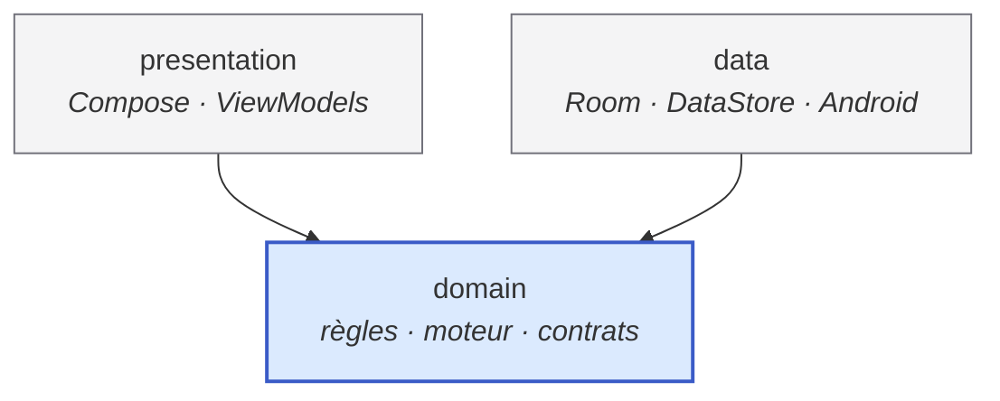
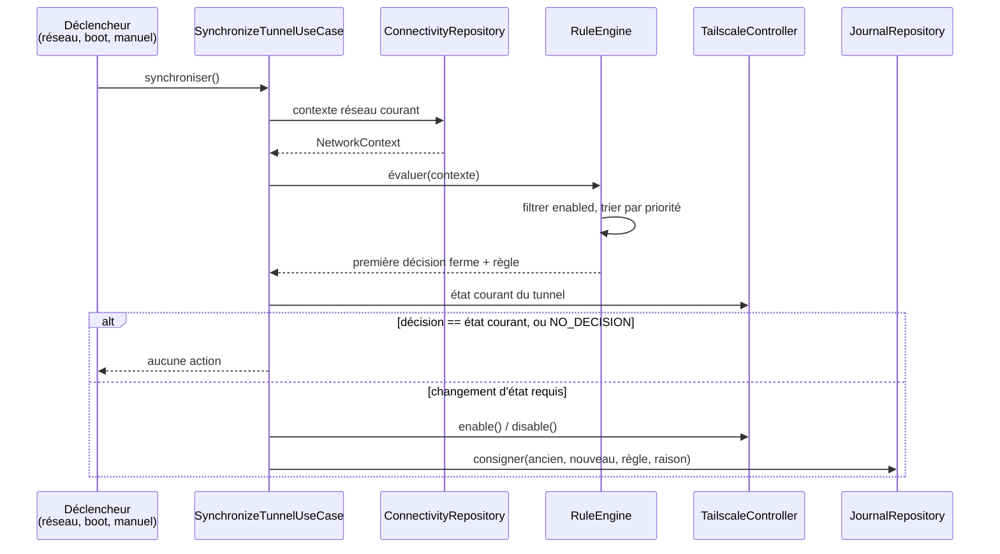
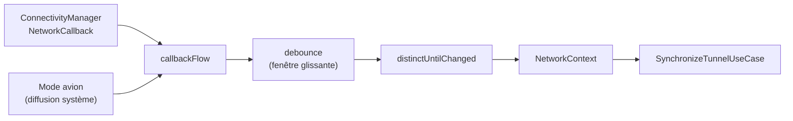

# Architecture — Tailscale Auto Rules

Ce document décrit **comment** le projet est construit. Le **quoi** est décrit
dans [SPECS.md](./SPECS.md).

> **État d'avancement.** Les sections marquées *(cible)* décrivent la structure
> visée ; elles se matérialisent au fil de [TASKS.md](./TASKS.md). Ce qui existe
> aujourd'hui est indiqué en §9. Ce document est mis à jour **à chaque étape**,
> jamais en avance.

---

## 1. Vue d'ensemble

Trois couches, une seule direction de dépendance.



**La règle de dépendance, unique et non négociable : tout pointe vers
`domain`, `domain` ne pointe vers rien.**

En particulier :

- `domain` ne contient **aucun** import `android.*`, `androidx.*`, Room,
  DataStore, Hilt ou Compose.
- `data` implémente les interfaces déclarées par `domain`.
- `presentation` consomme `domain` et ignore l'existence de `data`.

### 1.1 Pourquoi deux modules Gradle *(cible)*

La séparation en paquets repose sur la discipline ; la séparation en **modules
Gradle** la rend mécanique :

| Module | Type | Contenu |
|---|---|---|
| `:domain` | bibliothèque Kotlin/JVM pure | Modèle, règles, moteur, interfaces de contrat |
| `:app` | application Android | `presentation` + `data` + injection |

`:domain` n'a pas le SDK Android sur son classpath : une dépendance Android y
devient une **erreur de compilation**, et non une remarque de revue. Ses tests
sont de simples tests JUnit JVM, sans Robolectric ni émulateur.

`:app` regroupe `presentation` et `data`. Les séparer davantage n'apporterait
rien à ce stade : ils partagent le cycle de vie Android et ne sont pas
réutilisables indépendamment.

---

## 2. Structure des paquets *(cible)*

```
:domain  fr.vbrosseau.tailscaleautorules.domain
├── model/          TunnelState, NetworkContext, NetworkTransport, RuleDecision…
├── rule/           Rule, RuleId, RuleEvaluation + une classe par règle
├── engine/         RuleEngine — tri, évaluation, sélection
├── repository/     Interfaces : BlacklistRepository, JournalRepository, SettingsRepository
├── tailscale/      Interface TailscaleController
└── usecase/        SynchronizeTunnelUseCase — orchestration d'un cycle complet

:app     fr.vbrosseau.tailscaleautorules
├── presentation/
│   ├── theme/      AppTheme, palette, échelle d'espacement
│   ├── home/       HomeScreen, HomeViewModel, HomeUiState
│   ├── blacklist/  BlacklistScreen, BlacklistViewModel, BlacklistUiState
│   ├── settings/   SettingsScreen, SettingsViewModel, SettingsUiState
│   ├── journal/    JournalScreen, JournalViewModel, JournalUiState
│   └── navigation/ AppNavHost, destinations
├── data/
│   ├── local/      Base Room, DAO, entités, DataStore
│   ├── network/    Observation de la connectivité, lecture du SSID
│   ├── tailscale/  Implémentations de TailscaleController
│   └── repository/ Implémentations des interfaces de domain
├── service/        Service de premier plan, receivers (boot, mode avion), notification
└── di/             Modules Hilt
```

---

## 3. Le moteur de règles

C'est le cœur du projet et le seul composant dont la couverture de tests visée
est de ~100 %.

### 3.1 Pattern retenu — Strategy

Chaque règle est une **stratégie** indépendante implémentant un contrat commun.
Le moteur n'en connaît que le contrat. Conséquence directe : **ajouter une règle
consiste à ajouter une classe et à l'enregistrer dans l'injection — le moteur
n'est jamais modifié.**

### 3.2 Contrat

```kotlin
enum class RuleDecision { ENABLE, DISABLE, NO_DECISION }

interface Rule {
    val id: RuleId
    val priority: Int          // croissant = évalué en premier
    val isEnabled: Boolean

    fun evaluate(context: NetworkContext): RuleDecision
}
```

`evaluate` est **pure** : pas d'I/O, pas d'horloge, pas de journalisation, pas
d'accès à l'état du tunnel. Tout ce dont une règle a besoin est dans
`NetworkContext`.

C'est cette pureté qui rend la couverture exhaustive atteignable : une règle se
teste en construisant un contexte et en comparant la décision attendue.

### 3.3 Cycle de synchronisation



### 3.4 Ajouter une règle

1. Créer la classe dans `:domain/rule/`, implémentant `Rule`.
2. Choisir une `priority` qui ne crée pas d'ambiguïté avec les règles
   existantes (voir le tableau de [SPECS.md](./SPECS.md) §4).
3. Écrire ses tests unitaires : **chaque** branche de `evaluate`, y compris les
   cas retournant `NO_DECISION`.
4. Enrichir `NetworkContext` **uniquement** si la donnée nécessaire n'y est pas
   déjà — et alors mettre à jour les fabriques de test.
5. L'enregistrer dans le module Hilt des règles.

Aucune modification du moteur, ni des règles existantes, n'est requise. Si une
étape vous impose d'en modifier une, c'est le signe que l'abstraction est à
revoir : signalez-le plutôt que de contourner.

---

## 4. Abstraction de Tailscale

```kotlin
interface TailscaleController {
    suspend fun isAvailable(): Boolean
    suspend fun enable(): Result<Unit>
    suspend fun disable(): Result<Unit>
    suspend fun isRunning(): Boolean
}
```

| Implémentation | Module | Usage |
|---|---|---|
| `AndroidTailscaleController` | `:app` / `data/tailscale` | Production — diffusion explicite vers `IPNReceiver` |
| `FakeTailscaleController` | `:domain` / `testFixtures` | Tests — état en mémoire, inspectable, injection d'échec |

Les Fakes vivent dans le source set `testFixtures` de `:domain` : ils sont
ainsi partagés par les tests des deux modules sans être embarqués dans l'APK.

Le retour `Result` est délibéré : piloter une application tierce **échoue
normalement** — client absent, diffusion refusée, canal modifié. L'échec est
une valeur de retour attendue, pas une exception à rattraper au petit bonheur.
`TailscaleUnavailableException` distingue le cas « aucun client installé », qui
est une issue nominale.

Il n'existe pas d'implémentation `NoOp` : l'absence de client est déjà un
échec explicite d'`AndroidTailscaleController`. Une classe supplémentaire
n'ajouterait qu'un chemin de code à maintenir.

Le canal de commande retenu et ses trois contraintes sont établis et justifiés
dans [SPECS.md](./SPECS.md) §10.1.

---

## 5. Observation du réseau

`ConnectivityManager.NetworkCallback` est enveloppé dans un `Flow` par la couche
`data`, puis exposé au domaine sous forme de `NetworkContext`.



- **`debounce`** absorbe les rafales d'événements d'une même transition réseau.
- **`distinctUntilChanged`** garantit qu'un contexte identique ne provoque pas
  de nouvelle évaluation ; il repose sur l'égalité structurelle de
  `NetworkContext`.
- La fenêtre de debounce est **injectée**, jamais codée en dur : les tests la
  pilotent via l'ordonnanceur virtuel de `kotlinx-coroutines-test`.
- La synchronisation manuelle passe par `NetworkObserver.current()` et
  contourne donc le debounce.

Point de conception : la stabilisation est un **opérateur du domaine**
(`Flow<NetworkContext>.stabilized(window)`), pas un détail de la couche `data`.
La couche Android se contente de produire des contextes bruts et d'appliquer
l'opérateur. Le comportement le plus délicat du projet après le moteur se teste
ainsi en JVM pur, en temps virtuel, sans Robolectric.

La lecture du SSID emprunte deux chemins selon la plateforme :
`NetworkCapabilities.getTransportInfo()` à partir d'Android 12, `WifiManager`
avant. Sans permission de localisation, le système renvoie une valeur de repli,
traitée comme une indisponibilité — jamais comme un SSID valide.

Le temps est abstrait derrière une interface `Clock` du domaine. Aucun appel à
`System.currentTimeMillis()` en dehors de son implémentation.

---

## 6. Présentation

MVVM strict :

- Le ViewModel expose **un** `StateFlow<XxxUiState>` et rien d'autre.
- `UiState` est immuable et **complètement** descriptif de l'écran : un
  Composable ne calcule jamais.
- Le ViewModel **traduit** ; il ne décide pas. Toute logique métier vit dans un
  cas d'usage du domaine.
- Les Composables sont sans état, reçoivent l'état et des lambdas, et sont
  prévisualisables sans injection.

Une @Preview qui ne compile pas sans Hilt signale une fuite de responsabilité.

---

## 7. Injection de dépendances

Hilt, avec cette répartition :

| Module | Fournit |
|---|---|
| `DatabaseModule` | Base Room, DAO |
| `DataStoreModule` | DataStore de préférences |
| `RepositoryModule` | Liaisons interface (domain) → implémentation (data) |
| `TailscaleModule` | Implémentation de `TailscaleController` |
| `RuleModule` | Ensemble des `Rule` via `@IntoSet` |
| `DispatcherModule` | Dispatchers qualifiés, injectés et donc substituables |

`@IntoSet` est le point clé : le moteur reçoit un `Set<Rule>` et ignore
totalement quelles règles le composent.

Aucun singleton métier écrit à la main, aucun `object` porteur d'état. La portée
est déclarée à Hilt, jamais imposée par le langage.

---

## 8. Stratégie de test

| Niveau | Portée | Outillage |
|---|---|---|
| Unitaire — domaine | Règles, moteur, cas d'usage | JUnit + kotlin.test, JVM pur |
| Unitaire — data | DAO, DataStore, mappings | Robolectric ou instrumentation |
| Unitaire — présentation | ViewModels | `kotlinx-coroutines-test` + Fakes |
| UI | Écrans Compose | `compose-ui-test` |

Les doubles de test sont des **Fakes** — implémentations réelles et simplifiées,
versionnées dans le dépôt — et non des mocks générés :
`FakeTailscaleController`, `FakeNetworkObserver`, `FakeConnectivityRepository`,
`FakeClock`, `FakeLogger`. Un Fake se lit, se déboguer et ne casse pas quand une
signature bouge ailleurs.

Objectif de couverture : **~100 % sur `:domain`**. Ailleurs, la couverture est
une mesure, pas un objectif.

---

## 9. État actuel du dépôt

Étapes 1 à 4 de [TASKS.md](./TASKS.md). 26 tests, 0 échec.

```
.
├── domain/                  module Kotlin/JVM pur
│   └── src/
│       ├── main/kotlin/…/domain/
│       │   ├── model/       TunnelState, NetworkTransport, NetworkContext, RuleDecision
│       │   └── tailscale/   TailscaleController, TailscaleUnavailableException
│       ├── testFixtures/…/  FakeTailscaleController
│       └── test/…/          18 tests JVM
├── app/                     module application Android
│   └── src/
│       ├── main/
│       │   ├── kotlin/fr/vbrosseau/tailscaleautorules/
│       │   │   ├── TailscaleAutoRulesApplication.kt · MainActivity.kt
│       │   │   ├── data/tailscale/       AndroidTailscaleController
│       │   │   ├── di/                   DispatcherModule, TailscaleModule, qualifiers
│       │   │   └── presentation/theme/   AppTheme, Color, Spacing
│       │   ├── res/
│       │   └── AndroidManifest.xml
│       └── test/…/          8 tests Robolectric
├── config/detekt/detekt.yml
├── gradle/libs.versions.toml
├── build.gradle.kts · settings.gradle.kts · gradle.properties
└── documentation (voir README.md)
```

La contrainte du §1.1 est vérifiable à tout moment :

```console
$ ./gradlew :domain:dependencies --configuration compileClasspath
compileClasspath - Compile classpath for 'main'.
\--- org.jetbrains.kotlin:kotlin-stdlib:2.4.10
     \--- org.jetbrains:annotations:13.0
```

L'observation réseau, les règles, le moteur, la persistance et les écrans
**n'existent pas encore** : ils sont créés par les étapes 5 à 10. Cette section est mise à jour à chaque étape.

---

## 10. Décisions d'architecture

| # | Décision | Motif |
|---|---|---|
| 1 | `:domain` en module Kotlin/JVM séparé | Rend l'absence de dépendance Android vérifiable par le compilateur |
| 2 | Strategy pour les règles | Ajouter une règle sans modifier le moteur (ouvert/fermé) |
| 3 | `evaluate` pure | Rend la couverture exhaustive atteignable sans échafaudage |
| 4 | Première décision ferme retenue | Sémantique explicite, testable, sans arbitrage caché |
| 5 | `TailscaleController` derrière une interface | Isole un canal non contractuel : en cas de rupture, une seule classe est à reprendre |
| 6 | `Result` en retour du contrôleur | L'échec de pilotage d'une app tierce est nominal |
| 7 | Fakes plutôt que mocks | Lisibles, robustes au refactoring, sans magie |
| 8 | Debounce injecté | Testable en temps virtuel, ajustable sans recompiler la logique |
| 9 | Room pour les collections, DataStore pour les scalaires | Chaque outil sur son terrain, aucun recouvrement |
| 10 | Compose androidx (et non Compose Multiplatform) | Le projet est mono-plateforme ; API Android officielle |
| 11 | Fakes dans `testFixtures` de `:domain` | Partagés par les tests des deux modules, absents de l'APK |
