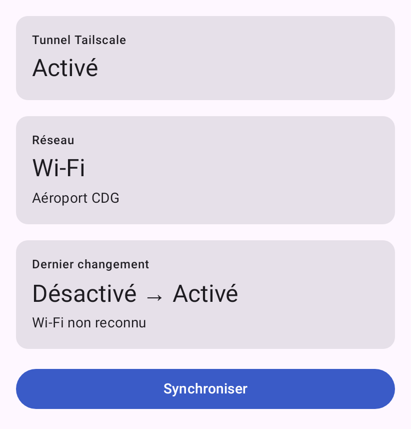
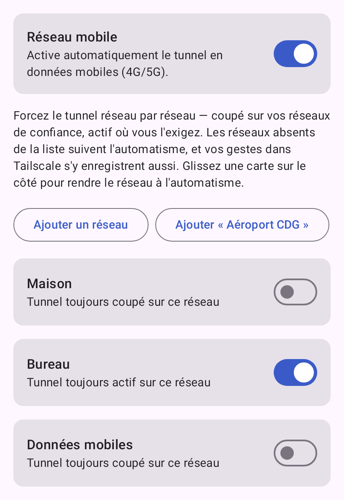
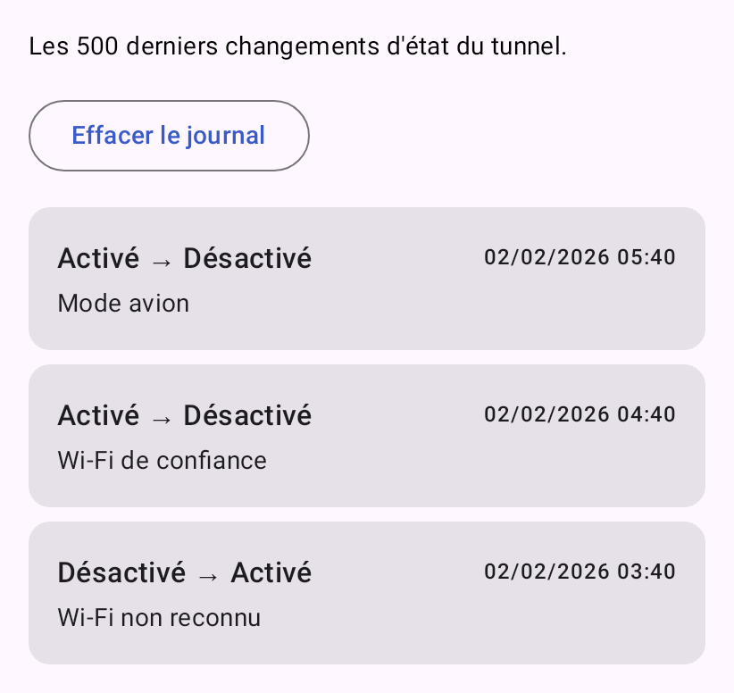
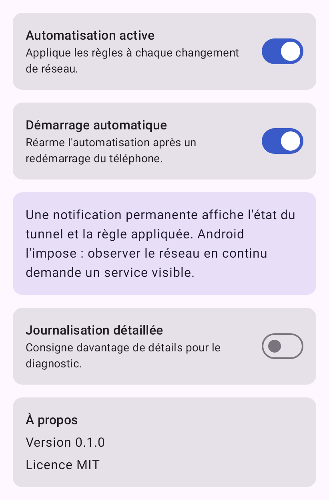

# Tailscale Auto Rules

**Active ou désactive votre tunnel Tailscale automatiquement, selon vos
connexions de confiance.**

[](https://github.com/c4software/tailscale-auto-rules/actions/workflows/ci.yml)
[](./LICENSE)
[](https://developer.android.com/tools/releases/platforms)

> ⚠️ **Première version fonctionnelle, pas encore publiée.** Les quatre écrans,
> le moteur de règles et l'automatisation sont livrés, testés, et **vérifiés sur
> un terminal réel** (Pixel 10 Pro) : application fermée, le tunnel s'active en
> passant en 5G et se désactive en retrouvant un réseau de confiance. Les
> réserves restantes sont listées en tête de [TASKS.md](./TASKS.md).

---

## Présentation

Sur mobile, on veut souvent que le VPN suive le contexte : **actif** sur le
réseau de l'aéroport, **inactif** à la maison où le tunnel n'apporte rien et
coûte de la batterie. Le faire à la main, c'est l'oublier une fois sur deux.

**Tailscale Auto Rules** s'en charge. L'application observe le réseau et
demande au client Tailscale officiel de s'activer ou de se désactiver selon les
connexions que vous jugez de confiance.

Elle **ne remplace pas Tailscale** et n'implémente aucune pile VPN : le client
officiel reste indispensable.

### Règles disponibles

| Priorité | Situation | Action |
|---:|---|---|
| 1 | Mode avion actif | Désactive le tunnel |
| 2 | Wi-Fi dans votre liste de réseaux de confiance | Désactive le tunnel |
| 3 | Tout autre Wi-Fi | Active le tunnel |
| 4 | Réseau mobile (4G / 5G) | Active le tunnel |
| — | Aucun réseau | Ne fait rien |

Chaque décision est justifiée par une règle nommée et consignée dans un journal
des 500 derniers événements.

Le moteur suit un pattern *Strategy* : **ajouter une règle n'implique aucune
modification du moteur existant.** Horaires, BSSID, niveau de batterie,
Bluetooth, Android Auto… sont des ajouts, pas des refontes.

### Pourquoi une notification permanente

Observer le réseau **exige un processus vivant**, donc un service visible,
auquel Android impose une notification permanente. Ce n'est pas contournable :
le seul mécanisme qui l'aurait permis ne délivre qu'un réveil unique avant que
le système ne le retire — constaté à la mesure, les relevés sont à l'étape 17
de [TASKS.md](./TASKS.md).

Une vérification espacée, sans service ni notification, a été écrite puis
retirée : Android n'accepte pas de période plus courte que quinze minutes. Une
application censée suivre le réseau qui réagirait un quart d'heure plus tard ne
rendrait pas le service promis.

La notification n'est donc pas un réglage, et l'écran des paramètres l'explique
au lieu de l'offrir. Elle affiche l'état du tunnel et la règle qui l'a décidé,
et disparaît si vous coupez l'automatisation.

### Ce que l'application ne fait pas

- **Elle ne vous localise pas.** La permission de localisation sert uniquement à
  lire le *nom* d'un réseau Wi-Fi — Android le classe comme donnée de
  localisation, et n'offre aucune autre voie. Elle n'est demandée qu'au moment
  où vous configurez un réseau de confiance, après explication. Le service ne
  s'en réclame que si vous l'avez accordée.
- **Elle n'envoie rien.** Aucun réseau, aucune télémétrie, aucun compte. Tout
  reste sur le téléphone.

---

## Captures d'écran

Les images ci-dessous sont les **références de test** produites par Roborazzi,
et non des captures retouchées : ce que vous voyez est exactement ce que rend
l'application.

| Accueil | Réseaux de confiance | Journal | Paramètres |
|:---:|:---:|:---:|:---:|
|  |  |  |  |

Chaque écran existe aussi en thème sombre dans
[`app/src/test/screenshots/`](app/src/test/screenshots/).

---

## Architecture en bref

Trois couches, une seule direction de dépendance : tout pointe vers le domaine,
le domaine ne pointe vers rien.

```
presentation ──▶ domain ◀── data
```

Le domaine — modèle, règles, moteur — est un module **Kotlin/JVM pur**, sans
SDK Android sur son classpath. Il s'exécute intégralement en test JVM, sans
émulateur.

**Kotlin · Jetpack Compose · Material 3 · MVVM · Hilt · Room · DataStore ·
StateFlow · Coroutines**

Le détail — couches, moteur de règles, cycle de synchronisation, décisions
d'architecture — est dans **[ARCHITECTURE.md](./ARCHITECTURE.md)**.

---

## Compilation

**Prérequis :** JDK 21 et le SDK Android (plateforme 37). Le wrapper Gradle et
la toolchain sont fournis, rien d'autre à installer.

```bash
git clone https://github.com/c4software/tailscale-auto-rules.git
cd tailscale-auto-rules

# Si vous utilisez le JDK embarqué d'Android Studio. `gradlew` lit JAVA_HOME
# en priorité : inutile de toucher au PATH.
export JAVA_HOME=$HOME/.local/share/JetBrains/Toolbox/apps/android-studio/jbr

./gradlew assembleDebug
```

L'APK est produit dans `app/build/outputs/apk/debug/`.

### Vérification complète

```bash
./gradlew ktlintCheck detekt lint test :domain:koverVerify assembleDebug
```

C'est exactement ce que vérifie la CI sur chaque Pull Request : formatage,
analyse statique, lint Android, tests, couverture du domaine, compilation.

`koverVerify` échoue sous 98 % de couverture sur `:domain`, qui est à
**100 % d'instructions et 98,7 % de branches**. Le seuil constate un acquis
plutôt qu'il ne fixe un objectif : il empêche une régression silencieuse.

### Rendu visuel

Les captures de référence se vérifient **à part**, et volontairement **hors
CI** : le rendu graphique coûte plusieurs minutes de temps machine, trop cher à
chaque Pull Request.

```bash
./gradlew :app:verifyRoborazziDebug   # comparer aux références
./gradlew :app:recordRoborazziDebug   # réenregistrer après un changement voulu
```

À lancer si — et seulement si — vous touchez à l'interface. Personne ne le fera
à votre place : une régression visuelle n'est rattrapée par aucune vérification
automatique.

---

## Publication sur le Play Store

> Trame vérifiée sur le papier, **pas encore éprouvée** : elle se complètera au
> premier envoi réel sur la Play Console.

1. Créer un keystore de release, **hors du dépôt**.
2. Renseigner `keystore.properties` (ignoré par Git) et le référencer dans la
   configuration de signature.
3. `./gradlew bundleRelease` → App Bundle dans `app/build/outputs/bundle/`.
4. Compléter la fiche Play Console : formulaire de sécurité des données,
   justification de chaque permission, politique de confidentialité.
5. **Déclarer les types de service de premier plan.** L'application emploie
   `specialUse` — observation continue du réseau, qu'aucun type prédéfini ne
   décrit — et `location`, seule façon de lire le nom d'un réseau Wi-Fi hors du
   premier plan. Chacun demande une justification écrite, et `specialUse` fait
   l'objet d'une revue manuelle.
6. Publier en test interne avant toute diffusion en production.

Les permissions restent minimales par conception : chacune n'est demandée que
si la fonctionnalité qui la justifie est activée par l'utilisateur (voir
[SPECS.md](./SPECS.md) §8).

---

## Contribution

Les contributions sont bienvenues. Lisez **[CONTRIBUTING.md](./CONTRIBUTING.md)**
avant d'ouvrir une Pull Request, et **[AGENTS.md](./AGENTS.md)** pour les
conventions de code et la définition de « terminé ».

---

## Documentation du projet

| Fichier | Contenu |
|---|---|
| [SPECS.md](./SPECS.md) | Spécification fonctionnelle — le **quoi** |
| [ARCHITECTURE.md](./ARCHITECTURE.md) | Architecture technique — le **comment** |
| [TASKS.md](./TASKS.md) | Feuille de route — l'**ordre** et l'avancement |
| [AGENTS.md](./AGENTS.md) | Règles de développement et conventions |
| [CONTRIBUTING.md](./CONTRIBUTING.md) | Comment contribuer |
| [CHANGELOG.md](./CHANGELOG.md) | Journal des modifications |
| [PROMPT.md](./PROMPT.md) | Intention initiale du projet (figée) |

---

## Licence

[MIT](./LICENSE).

Ce projet n'est pas affilié à Tailscale Inc. « Tailscale » est une marque de
Tailscale Inc., citée ici à des fins d'interopérabilité.
